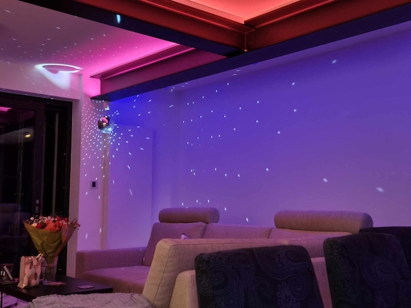

# VinylStation
Transform a Raspberry Pi (4, or 3+) into a webradio streaming engine (Icecast and HLS output) for vinyl records. Grabs metadata from Shazam for played records.

This script leverages OpenSource projects Liquidsoap (https://github.com/savonet), songrec (https://github.com/marin-m/SongRec) and all of their related libraries.
Endless thanks go to the developers of these projects.

## Disclaimer
This project is an amateur / hobbyist effort. Under no circumstances does it claim to be ready for use in a production environment. It serves educational and geeky purposes.

## Project philosphy
Upon unwrapping my late dad's vintage HiFi setup he got just before my birth, I got hooked (again) on listening to vinyl records. However, as I built a smart home over the past years, I was wondering whether it would be possible to stream the vinyl records onto the SONOS devices in the house's rooms. Of course, the stream, stemming from an analogue source should embed the appropriate metadata. And so, the challenge was set.

## What project VinylStation achieves
- Capture analogue audio over a USB interface (phono preamp in this case)
- Fingerprint the audio using songrec which, in turn, is an opensource client for Shazam
- Embed the gathered metadata into the audio stream
- Output the digitised stream through Icecast
- Output the digitised stream over HLS
  
## Requirements:
- Raspberry Pi 4 or 3b+ with internet access (WARNING: My test have shown that a **Raspi 3b**+ is capable at most of outputting **one** HLS stream alongside audio fingerprinting. If you should choose to output multiple audio streams, expect considerable dropouts! Please adapt the configuration files accordingly.) 
- Recent Raspbian OS Lite (≥ Bookworm, ≥ 32-bit)
- Micro SD card (8Gb is enough)
- A USB (Phono Preamp) sound interface **Note**: In fact, you can hook up any analog audio source, as the underlying software is source media agnostic. Successfully tested have been: https://www.behringer.com/product.html?modelCode=0805-AAF and https://artproaudio.com/phonopreamps/product/357989/usbphonoplusprojectseries 

## Relevant sofware packages:
- Liquidsoap - open-source stream generator
- songrec - open-source Shazam client
- pulseaudio (for simultaneous access to the sound device by liquisoap and songrec)

## Script logic:
1. Prepare host with prerequisites
2. Install OPAM and create a compatible switch for compiling
3. Pull up-to-date songrec source code and compile
4. Pull up-to-date/rolling-release Liquidsoap source code and compile
5. Write the necessary configuration files
6. Enable auto-start of liquidsoap services which hosts Icecast and HLS output

## Roadmap:
A) Continuous bugfixes.\
B) Implement nginx webserver to provide metadata on music playing.\
C) Create history and statistics on music played.

## Installation:
Log into your Raspberry Pi and run :\
```bash <(curl -fsSL https://raw.githubusercontent.com/mojikosu/vinylstation/refs/heads/main/installVinylstation.sh)```

## JSON Web output:
Selected metadata is available in JSON format under ```http://your VinylStation IP here:7000/getmeta```

## SONOS integration:
If you tap into the HLS output available under ```http;//your VinylStation IP here:8080/vinylstation.m3u8``` on your SONOS system, metadata including coverart are displayed within the SONOS app. The metadata are gathered from Shazam via songrec.\
It looks like this:\


## Home Assistant
I use Home Assistant (https://www.home-assistant.io) with the SONOS devices to tap into the metadata and coverart to set the mood lighting in the living room dynamically using ad-media-lights-sync (https://github.com/ericmatte/ad-media-lights-sync/releases/tag/v0.6.0) running under Home Assistant's AppDaemon Add-on. It's a lot of fun, see here. 
(Yes, the disco ball is illuminated, based on the genre of the track played. Thank you for asking. ;) )\

